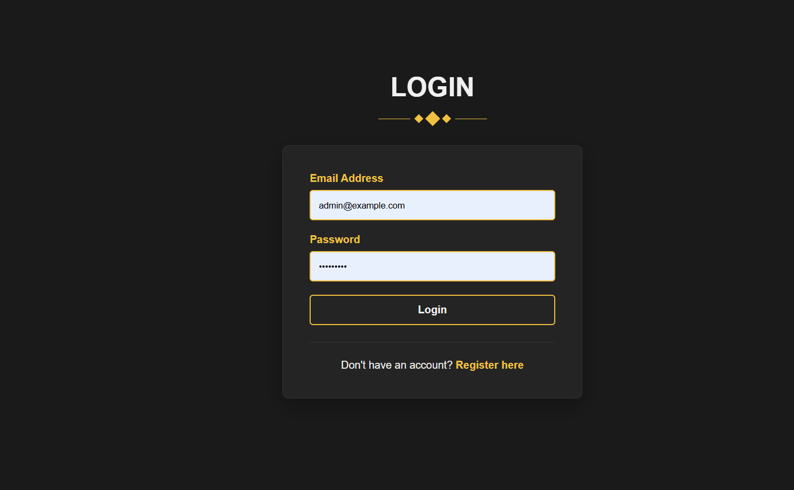
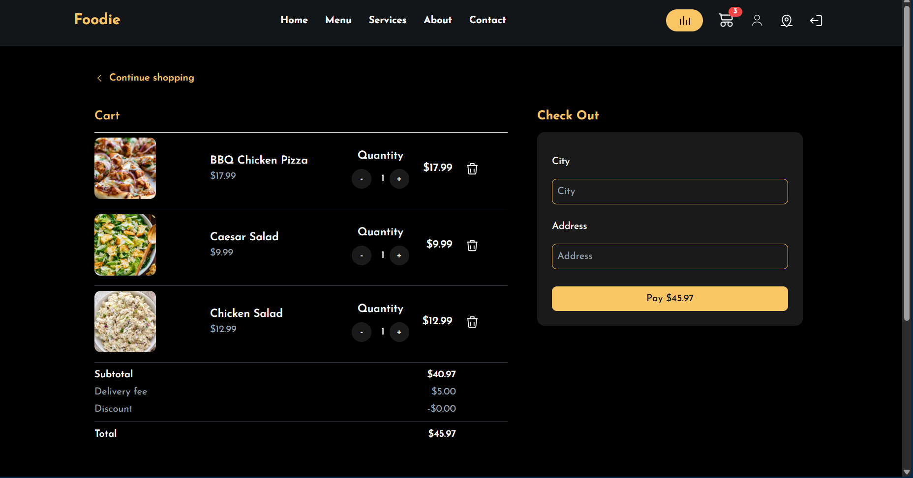
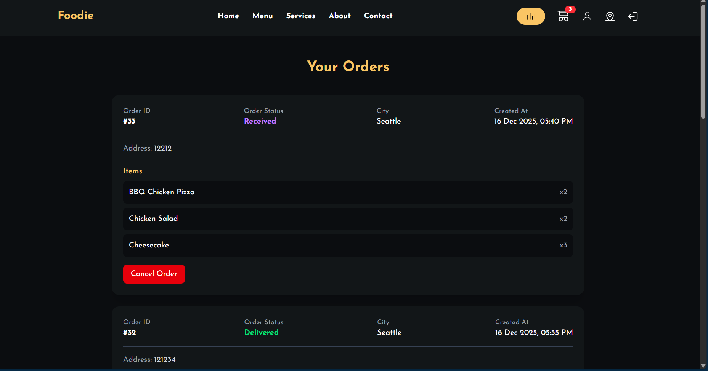
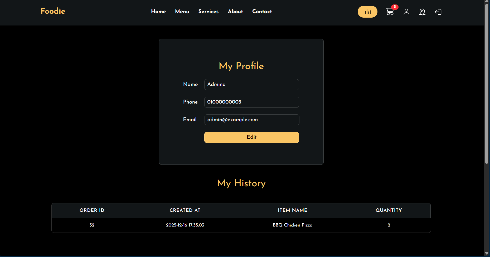
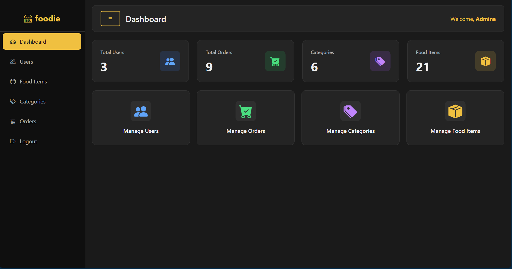
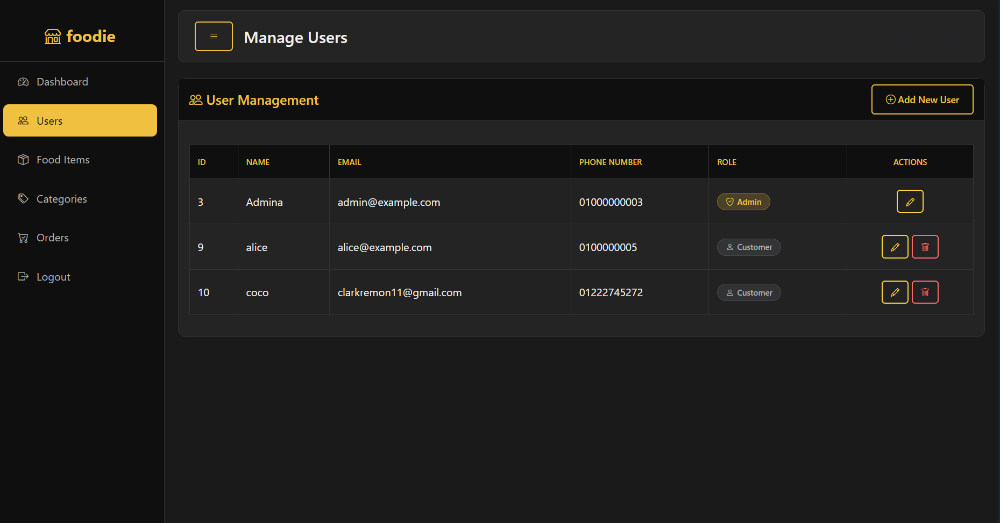
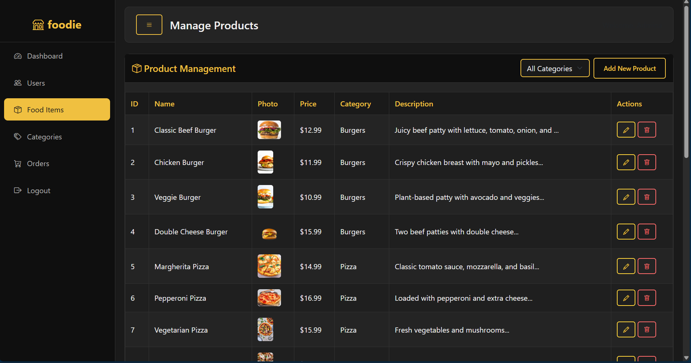
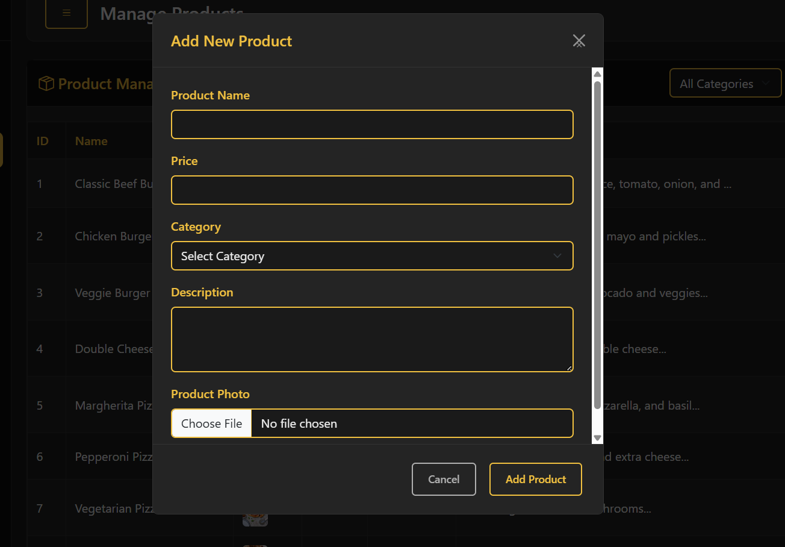
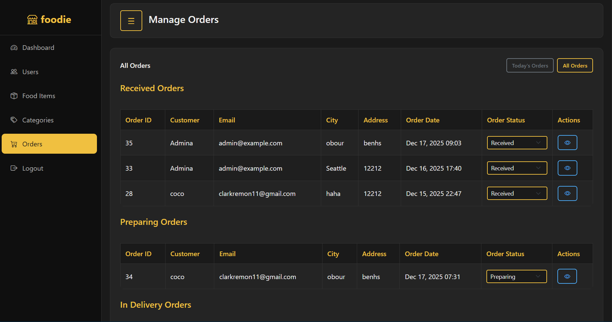

# Foodie - College Web Project

A full-featured food delivery e-commerce web application built with HTML, CSS, Bootstrap, PHP, and MySQL. This project was developed as a college project to demonstrate full-stack web development capabilities, including database design, session management, and dynamic content rendering.

## 📸 Project Screenshots

### User Interface

**Login Page**


**Home Page**
<video src="https://github.com/OmarNabil05/BfCAI_Web_Team/assets/home.mp4" controls width="600"></video>

**Menu**
<video src="https://github.com/OmarNabil05/BfCAI_Web_Team/assets/menu.mp4" controls width="600"></video>

**Shopping Cart**


**Track Orders**


**User Profile**


### Admin Interface

**Admin Dashboard**


**Manage Users**


**Manage Items**


**Add New Item**


**Manage Orders**


##  Key Features

### Admin Panel
- **Dashboard**: Overview of system statistics.
- **User Management**: View and manage customer accounts.
- **Product Management**: Add, edit, and delete products with image upload (BLOB storage).
- **Category Management**: Manage product categories.
- **Order Management**: 
  - 5-stage order workflow (Received  Preparing  In Delivery  Delivered/Cancelled).
  - Date filtering and status tracking.

### Customer Frontend
- **Home Page**: Featured categories and popular items.
- **Browse Menu**: View all available food items.
- **Shopping Cart**: Add/remove items, adjust quantities.
- **User Account**: Profile management and order history.

##  Technologies Used

- **Frontend**: HTML5, CSS, Bootstrap 5.3.2, JavaScript
- **Backend**: PHP 8.0
- **Database**: MySQL (MariaDB 10.4)
- **Server**: Apache (XAMPP)
- **Version Control**: Git & GitHub
- **Tools**: VS Code, phpMyAdmin

## 📂 Project Structure

```
Web_project/
├── index.php                    # Landing page
├── image.php                    # Image serving endpoint (BLOB storage)
├── config/
│   └── db.php                   # Database connection
├── database/
│   └── my_store.sql             # Complete database schema
├── docs/                        # Documentation and ERD
├── screenshots/                 # Project screenshots
├── modules/
│   ├── auth/                    # Authentication System (Login, Register)
│   ├── admin/                   # Admin Panel (Dashboard, Products, Orders)
│   └── restaurant/              # Customer Frontend (Home, Menu, Cart)
└── README.md
```

## 🗄️ Database & ERD

The project uses a relational MySQL database. Images are stored directly in the database using `LONGBLOB` columns to ensure data integrity and portability.

### Entity Relationship Diagram (ERD)
You can view the detailed ERD in the documentation folder:
- [View ERD PDF](docs/ERD_Foodie.pdf)

### Schema Overview
- **Users**: Stores customer and admin information.
- **Categories**: Product categories.
- **Items**: Food items linked to categories.
- **Orders**: Order details with status tracking.
- **Order_Items**: Many-to-many relationship between orders and items.
- **Images**: Centralized table for storing all application images.

## 🔄 Git Workflow

The team followed a feature-based workflow to minimize conflicts:
1.  **Feature Branches**: Each feature (e.g., `feature/cart`, `feature/admin-panel`) was developed in a separate branch.
2.  **Modular Development**: Developers worked in isolated folders within `modules/`.
3.  **Pull Requests**: Changes were reviewed and merged into the `main` branch.

## 👥 Contributors

made with love and profession by:

- **Omar Nabil**
- **Farah Mohamed**
- **Vivian Boshra**
- **Clark Remon**
- **Kerolos Akmal**
- **Michael Gayed**

## 🏁 Getting Started

1.  **Clone the repository**:
    ```bash
    git clone https://github.com/OmarNabil05/BfCAI_Web_Team.git
    ```
2.  **Setup Database**:
    - Import `database/my_store.sql` into your MySQL server (phpMyAdmin).
    - Configure `config/db.php` with your database credentials.
3.  **Run the Application**:
    - Host the project folder in your local server (e.g., `xampp/htdocs`).
    - Visit `http://localhost/Web_project/` in your browser.

